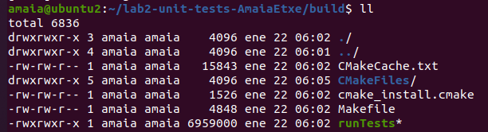

# dps-laboratory2
Amaia Echeandia
aechep00@estudiantes.unileon.es

El objetivo de esta prática es lanzar los tests del repositorio "lab2-unit-tests-AmaiaEtxe" con gtest.

Primeramente tendremos que instalarnos libgtest-dev y cmake en nuestra máquina si es que no lo tenemos ya.
Clonamos el repositorio localmente y nos iremos a la carpeta /usr/src/gtest. Desde esta carpeta lanzamos cmake CMakeLists.txt y sudo make para compilarlo:


A continuación, copiaremos las librerías libgtest y libgtest_main que nos harían falta para lanzar las pruebas de la carpeta /lib a /usr/lib.


Lo siguiente será volver a la carpeta con los archivos clonados del repositorio "lab2-unit-tests-AmaiaEtxe", borraremos la carpeta build en caso de que estuviera creada y volvemos a crear una nueva vacía. Lanzamos los siguientes comandos para compilar:
```
$ cmake ..
$ make
```
Nos aseguramos que ya tenemos los tests en la carpeta:



Y, finalmente ejecutamos ./runTests exitósamente!!


